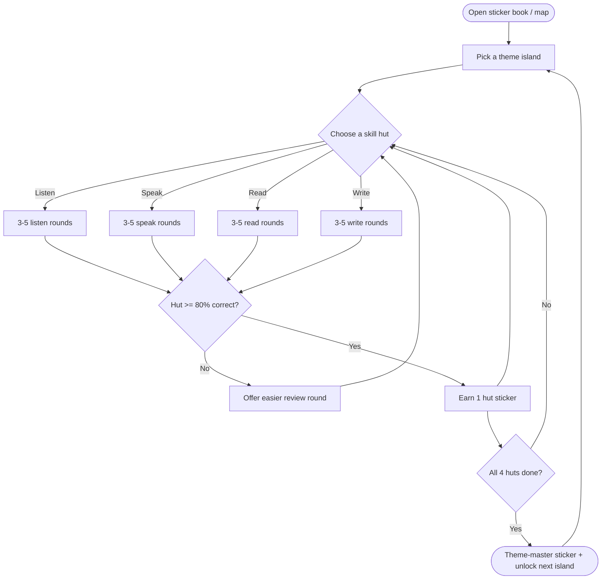

# OLA English Adventure — Game Design Spec

> Status: Draft v0.1 — for review before build
> Slots alongside: `ila-english-adventure-module.md` (pedagogy engine), `22-english-theme-weather.md` (first theme), `english-adventure-handoff.md`
> Stack assumption: Next.js 15 + TypeScript + Tailwind + Supabase + Vercel; audio via browser SpeechSynthesis
> Working name: **OLA English Adventure** (rename freely)

---

## 1. Purpose

A sticker-collecting game that reinforces the four skills — Listening, Speaking, Reading, Writing — for children aged 4–7, aligned to the OLA Academy (ILA) Cambridge curriculum and run in parallel with the Cambridge YLE progression: **Starters → Movers → Flyers**.

The game does not replace class. It reinforces the current term's vocabulary at home in short, low-pressure sessions, and gives the parent visible proof of progress (a filling sticker book).

Non-goals for v1: no points/coins/lives, no leaderboards, no timers, no social features, no in-app purchases.

---

## 2. Target users (research personas)

| Persona | Profile | Primary job-to-be-done |
|---|---|---|
| Bé Minh (4–5, pre-reader) | Cannot read instructions; short attention; taps and listens. | "Let me succeed without anyone reading to me." |
| Bé Linh (6–7, emergent reader) | Recognizes letters and short words; wants to feel "big." | "Let me show I can read and spell, not just tap pictures." |
| Parent | Wants visible progress, safety, no ads, short sessions. | "Show me my child learned something today." |
| OLA teacher | Wants game vocabulary to match the Cambridge level taught in class. | "Reinforce this week's wordlist, don't contradict it." |

The pre-reader persona is the hardest constraint and drives most design rules below.

---

## 3. Game concept & core loop

Each theme is a **map island**. Inside an island are **4 skill huts** (Listen / Speak / Read / Write). The child completes short rounds in each hut, earns a sticker per hut, and a special milestone sticker for mastering the whole island.

Session shape: a child can finish one hut in ~2–3 minutes. A full island is one or several sittings. Nothing forces completion in one go.

---

## 4. Game rules (kept deliberately simple)

1. **One task per screen.** Never two decisions at once.
2. **Listen first.** Every instruction is spoken aloud; no reading is required to play.
3. **Tap to answer.** Touch targets ≥ 72px; Level 1 needs no typing.
4. **No timers, no losing.** A wrong tap gives a gentle hint and a retry — never "game over."
5. **Finish a hut → earn a sticker.** Finish all 4 huts → master the theme.
6. **Mastery threshold ≈ 80%** (e.g. 4 of 5 correct). Below it, the hut offers an easier review round rather than blocking.
7. **Difficulty is set by level** (Starter / Mover / Flyer), chosen once via a 3-question placement and adjustable by parent or teacher. Level is tracked **per skill**, not per game.

These rules are the implementation of the module's pedagogical engine (scaffold before answer, one step per screen, specific feedback, active recall with interleaving, mastery thresholds).

---

## 5. Skill mechanics × Cambridge levels

Levels are progression tiers loosely tied to age. A strong 5-year-old may sit at Mover; a cautious 7-year-old at Starter. Vocabulary in each level is sourced from the matching **Cambridge YLE wordlist** — not improvised.

| Skill | L1 — Starter (≈4–5, Pre-A1) | L2 — Mover (≈6, A1) | L3 — Flyer (≈7, A2) |
|---|---|---|---|
| Listen | Hear a word → tap matching picture (2 choices) | Hear a word → tap picture (3 choices, no picture hint) | Hear a short sentence → tap the scene it describes (4 choices) |
| Speak | Hear model word → repeat → child taps stars to self-rate ("did it sound the same?") | Repeat word; speech recognition checks with generous matching | Answer a spoken question in one short phrase ("How's the weather?" → "It's sunny") |
| Read | Match a printed word to its picture (sight-word recognition) | Read a word with no audio → tap matching picture | Read a short sentence → pick true/false or the matching picture |
| Write | Trace the letter/word along a guided finger path | Drag letter tiles to spell the word (picture + first-letter hint) | Build a short sentence from word tiles (e.g. It / is / windy) |

---

## 6. Reward & sticker system

- **Per hut:** 1 themed sticker (4 collectible per island).
- **Per theme mastered:** 1 special master sticker (the milestone) + next island unlocks.
- **Streak stickers:** small bonus for playing on consecutive days — encourages habit, applies no pressure.
- **No points, coins, lives, or leaderboards.** Stickers are the only currency.
- **Sticker book** is the home/landing screen the child is proud to open; persistent across sessions (Supabase, keyed to child profile).

Milestone definition: a milestone = all 4 huts of one theme mastered. Achievement = a single hut mastered.

---

## 7. Progression & retention logic

- **Interleaving:** new themes mix in a few words from earlier mastered themes (active recall outperforms re-showing the same set).
- **No fail state:** wrong → scaffold (highlight correct, slow the audio, reduce choice count) → retry. Repeated misses lower difficulty for that round, never end it.
- **Mastery gates the milestone, not the play:** a child can keep replaying a mastered hut for fun and stickers stay earned.

---

## 8. UI / UX & accessibility constraints

Carried directly from the module spec:

- Touch targets ≥ 72px; generous spacing for imprecise taps.
- Audio-first: all prompts use SpeechSynthesis; replay button on every screen.
- Color is never the only signal (pair with icon/shape/position) — supports color-blind and pre-literate kids.
- Respect `prefers-reduced-motion`; keep animations short and skippable.
- Large, friendly art; minimal text on Level 1 screens.
- Vietnamese support for parent/teacher-facing surfaces (placement, settings); child gameplay stays in English.

---

## 9. Open risks (flagged early)

1. **Speech recognition is the weak point.** Browser ASR on 4-year-olds with Vietnamese-accented English is unreliable and will mark correct attempts as wrong. Recommendation: Level 1 Speak uses **echo-and-self-rate (no ASR)**; only Levels 2–3 attempt recognition with very loose matching and an easy "I said it" override.
2. **Wide age band (4–7).** Per-skill leveling and the placement check are essential — a child can be Flyer at Listening but Starter at Writing.
3. **Privacy.** If Speak records audio, decide up front whether anything leaves the device. Safest default: on-device only, nothing stored or transmitted.
4. **Content alignment.** "Linking to Starter/Mover/Flyer" only holds if wordlists come from the real Cambridge YLE lists and ideally match the OLA term plan. Needs a source-of-truth file.

---

## 10. Research to run before/with the build (user-research)

Two lightweight studies, not a program:

- **Usability test, 5–6 children** across the age band. Core question to observe: can a child start and complete a hut **without an adult reading to them**? Secondary: does the Speak hut frustrate them?
- **Teacher/parent interviews, 4–5 sessions.** Confirm the level mapping matches what OLA actually teaches per term, and define what "progress" a parent wants to see in the sticker book.

Analysis: affinity-map observations into themes; prioritize fixes on an impact/effort matrix before Phase 2.

---

## 11. Suggested build phasing

- **Phase 1 — Vertical slice:** one theme (Weather, already specced in `22-english-theme-weather.md`), all 4 huts, Level 1 + Level 2 only, sticker book with 4 + 1 stickers. Prove the core loop and the no-reading bet.
- **Phase 2 — Level 3 + second theme:** add Flyer mechanics (sentence build, sentence listen) and interleaving across two themes.
- **Phase 3 — Placement, streaks, parent/teacher dashboard:** per-skill leveling, streak stickers, progress view, term-aligned wordlist import.

---

## 12. Open questions for review

- Confirm the level → age mapping against OLA's actual term structure.
- Confirm sticker-only rewards are enough motivation, or whether a light "avatar dress-up with stickers" layer is wanted in Phase 3.
- Decide the Speak approach (echo-and-self-rate vs ASR) per level — this is the biggest UX fork.
- Confirm wordlist source of truth (official Cambridge YLE list file vs OLA-provided term lists).
